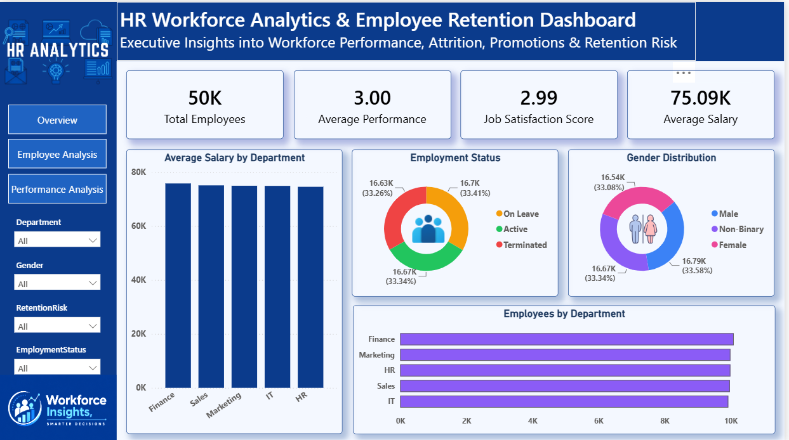

HR Workforce Analytics & Employee Retention
Dashboard
Project Overview
The HR Workforce Analytics & Employee Retention Dashboard is an end-to-end Business Intelligence project
developed to analyze workforce trends, employee performance, retention risks, promotion patterns, and
organizational effectiveness.
The objective of this project is to help HR teams and business leaders make data-driven decisions by
identifying workforce strengths, monitoring employee turnover, and evaluating factors that influence
employee growth and retention.
The solution was built using Excel, SQL, Power BI, and DAX, following the complete analytics lifecycle from
data preparation and exploration to dashboard development and insight generation.
Business Problem
Human Resource departments often struggle to monitor employee retention, understand attrition drivers,
and evaluate workforce performance across different departments.
This project addresses key business challenges such as:
• 
• 
• 
• 
• 
Identifying departments with higher attrition rates
Monitoring employee retention risk
Evaluating promotion and performance trends
Understanding workforce demographics and composition
Supporting strategic workforce planning
Tools & Technologies
• 
• 
• 
• 
• 
Microsoft Excel
SQL
Power BI
DAX
Git & GitHub
1
Project Workflow
1. Data Preparation
• 
• 
• 
Cleaned and validated HR employee records
Handled missing and inconsistent values
Standardized employee attributes for analysis
2. SQL Analysis
• 
• 
• 
Explored workforce trends using SQL queries
Analyzed employee demographics and department-level metrics
Generated insights related to retention and performance
3. Data Modeling
• 
• 
Created relationships and optimized data structure
Built calculated measures using DAX
4. Dashboard Development
• 
• 
• 
Designed interactive Power BI dashboards
Implemented KPI cards, charts, slicers, and drill-down functionality
Created executive-level workforce reporting views
Dashboard Pages
Executive Workforce Overview
Provides a high-level summary of the organization’s workforce.
Key Metrics
• 
• 
• 
• 
Total Employees
Average Salary
Average Performance Rating
Average Job Satisfaction Score
Analysis Included
• 
• 
• 
• 
Workforce Distribution by Department
Gender Composition
Employment Status Breakdown
Salary Analysis by Department
2
Employee Attrition & Retention Analysis
Focused on employee turnover and workforce stability.
Key Metrics
• 
• 
• 
• 
Attrition Count
Attrition Rate
High-Risk Employees
Average Satisfaction Score
Analysis Included
• 
• 
• 
• 
• 
Attrition by Department
Attrition by Gender
Retention Risk Segmentation
Employee Exit Reasons
Satisfaction Analysis
Performance, Promotion & Leadership Analysis
Evaluates employee development and organizational growth.
Key Metrics
• 
• 
• 
• 
Average Performance Rating
Total Promotions
Average Training Hours
Average Employee Tenure
Analysis Included
• 
• 
• 
• 
• 
Department Performance Comparison
Promotion Trends
Training Effectiveness
Leadership Impact Analysis
Internal Promotion Distribution
Key Insights
• 
• 
• 
• 
• 
Workforce consists of 50,000 employees.
Average employee salary is approximately 75K.
Average performance rating remains stable across departments.
Employee attrition rate exceeds 33%, indicating retention improvement opportunities.
Promotion and training participation show a positive relationship with employee performance.
3
Certain departments demonstrate higher retention risk and require focused HR intervention.
• 
Skills Demonstrated
• 
• 
• 
• 
• 
• 
• 
• 
• 
• 
Data Cleaning & Preparation
Exploratory Data Analysis (EDA)
SQL Query Writing
Data Modeling
DAX Measures & Calculations
Business Intelligence Reporting
Dashboard Design
HR Analytics
Data Visualization
Insight Generation
Dashboard Preview
Executive Workforce Overview

Employee Attrition & Retention Analysis

Performance, Promotion & Leadership Analysis

Repository Structure
HR-Workforce-Analytics-Dashboard
├── Dataset
├── Excel
├── SQL
├── PowerBI
├── Dashboard_Images
└── README.md
4
Author
Rajveer Singh Rathore

Aspiring Data Analyst passionate about transforming data into actionable business insights using Excel,
SQL, Python, and Power BI.
GitHub Portfolio: https://github.com/kumtaditi23
