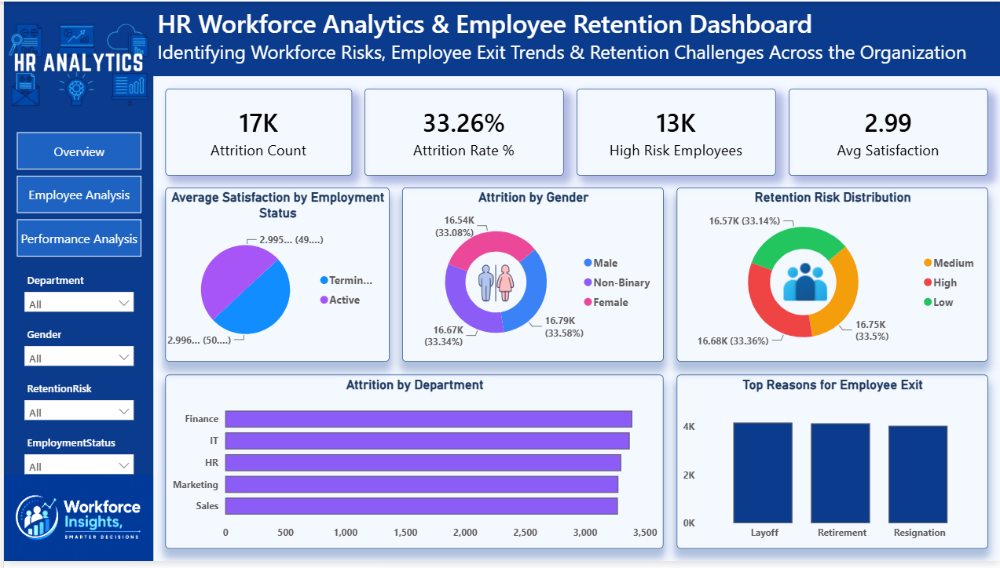
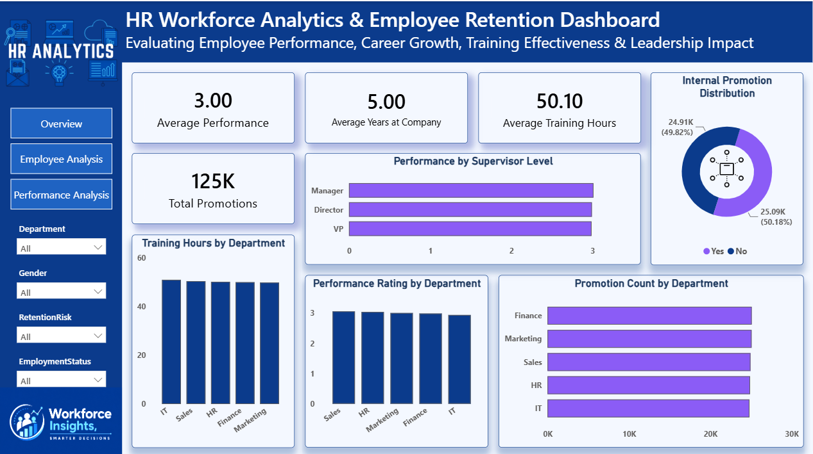

# HR Workforce Analytics & Employee Retention Dashboard

## Project Summary

Managing a large workforce requires more than simply tracking employee numbers. Organizations need visibility into employee performance, retention patterns, promotion opportunities, and workforce risks to make informed business decisions.

This project was developed to analyze HR data and transform raw employee records into meaningful insights through interactive dashboards. Using a dataset containing 50,000 employee records, the solution helps identify workforce trends, monitor employee turnover, evaluate performance indicators, and support strategic HR planning.

The project combines Excel, SQL, and Power BI to create a complete analytics workflow from data preparation to business reporting.

---

## Objective

The primary goal of this project is to provide HR teams with a centralized view of workforce performance and employee retention.

The dashboard helps answer questions such as:

* How is the workforce distributed across departments?
* Which areas of the organization experience higher employee turnover?
* What patterns exist in employee satisfaction and retention risk?
* How do promotions and training contribute to employee performance?
* Which employee groups may require additional HR attention?

---

## Technology Stack

* Microsoft Excel
* SQL
* Power BI
* DAX
* Git & GitHub

---

## Project Approach

### Data Preparation

The employee dataset was reviewed, cleaned, and standardized to ensure consistency before analysis. Missing values and data quality issues were addressed to improve reporting accuracy.

### Data Exploration

SQL queries were used to examine workforce trends, department-level statistics, employee performance metrics, and retention-related indicators.

### Dashboard Development

Power BI was used to build interactive dashboards that allow users to explore workforce information through filters, KPIs, and visual reports.

### Business Insight Generation

DAX measures were created to calculate important HR metrics and support deeper analysis of workforce behavior and organizational performance.

---

## Dashboard Components

### Workforce Overview

Provides a summary of the organization’s employee population and workforce composition.

Key areas covered:

* Employee distribution
* Department-wise workforce analysis
* Salary overview
* Gender representation
* Employment status breakdown

---

### Attrition & Retention Analysis

Focused on understanding employee turnover and identifying potential retention challenges.

Key areas covered:

* Attrition trends
* Department-level turnover analysis
* Retention risk categories
* Employee exit patterns
* Satisfaction score analysis

---

### Performance & Promotion Analysis

Examines employee development, training participation, and leadership effectiveness.

Key areas covered:

* Performance ratings
* Promotion trends
* Training participation
* Employee tenure analysis
* Leadership impact assessment

---

## Key Business Insights

* The workforce consists of approximately 50,000 employees.
* Employee turnover varies significantly across departments.
* Satisfaction levels show a measurable relationship with retention risk.
* Employees participating in development programs tend to demonstrate stronger performance outcomes.
* Promotion opportunities appear to influence long-term employee engagement.

---

## Skills Applied

* Data Cleaning
* Data Validation
* SQL Analysis
* Business Intelligence Reporting
* Data Visualization
* DAX Calculations
* Workforce Analytics
* Dashboard Design
* Insight Communication

---

## Dashboard Preview

### Executive Workforce Overview

### Employee Attrition & Retention Analysis

### Performance, Promotion & Leadership Analysis

---

## Repository Structure

HR-Workforce-Analytics-Dashboard

├── Dataset
├── Excel
├── SQL
├── PowerBI
├── Dashboard_Images
└── README.md

---

## Author

**Rajveer Singh Rathore**

Data Analytics Enthusiast focused on transforming business data into practical insights through Excel, SQL, Python, and Power BI.
